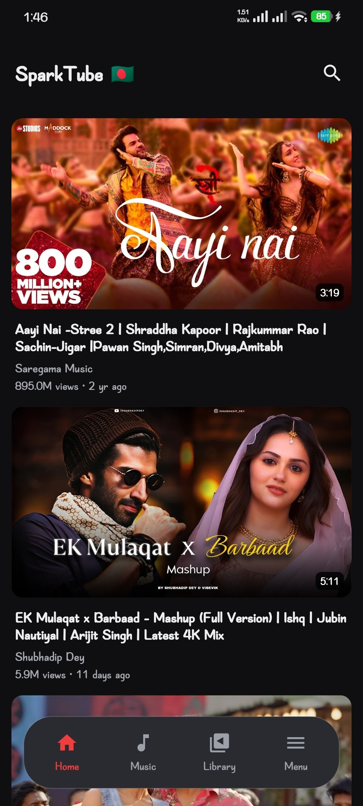
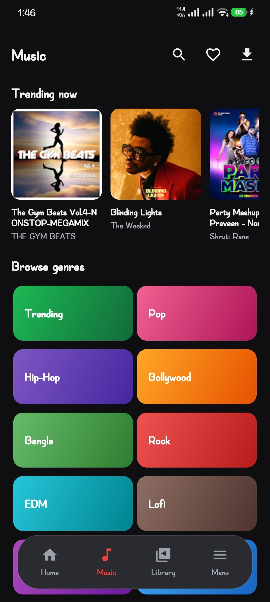
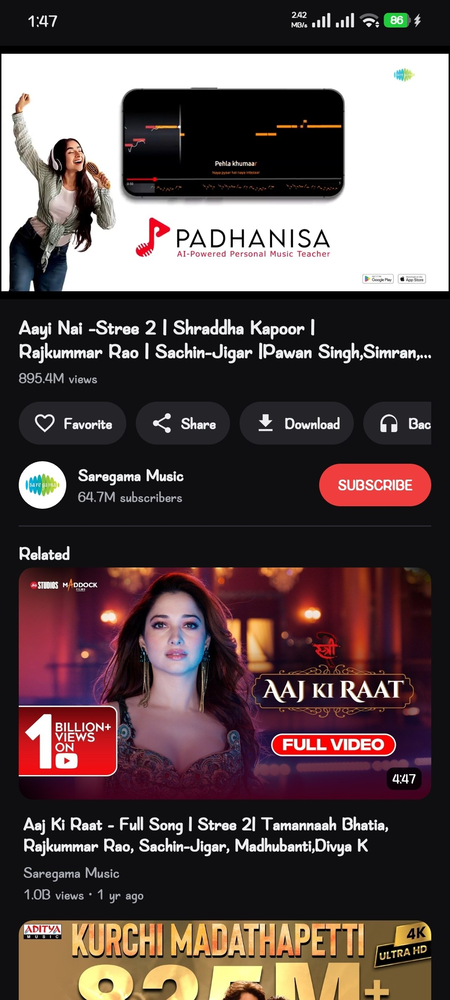
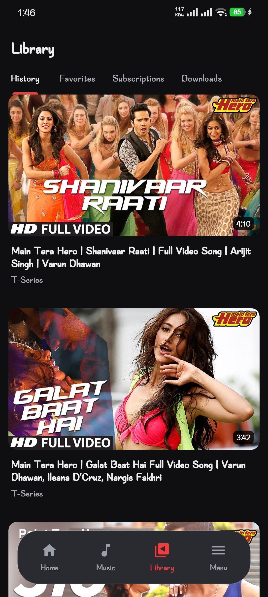
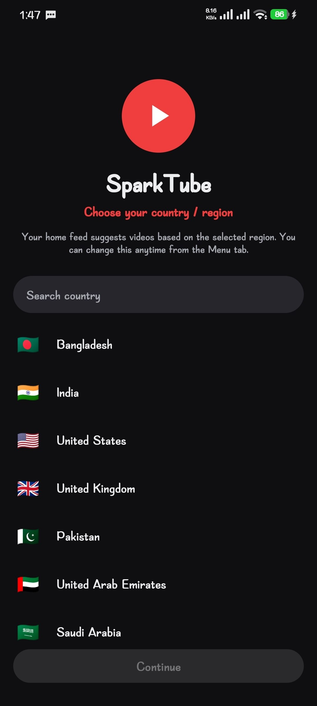
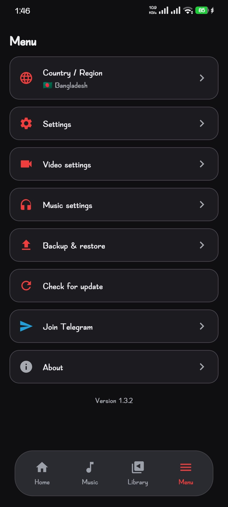

<div align="center">

# ⚡ SparkTube

**A lightweight, fully anonymous YouTube client for Android — built with Kotlin & NewPipeExtractor.**

No Google account. No API keys. No tracking. No live streams.

<br>

[](https://github.com/devfahim00/SparkTube/releases)
[](https://github.com/devfahim00/SparkTube/releases/latest)

<br>

[](https://kotlinlang.org/)
[](https://developer.android.com/)
[](https://m3.material.io/)
[](https://gradle.org/)
[](https://adoptium.net/)

[](https://github.com/devfahim00/SparkTube/stargazers)
[](https://github.com/devfahim00/SparkTube/network/members)
[](https://github.com/devfahim00/SparkTube/issues)
[](https://github.com/devfahim00/SparkTube/commits/main)
[](https://github.com/devfahim00/SparkTube)
[](#-contributing)
[](#-license)

[**Download**](#-download) •
[**Features**](#-features) •
[**Screenshots**](#-screenshots) •
[**Getting Started**](#-getting-started) •
[**Tech Stack**](#-tech-stack) •
[**Contributing**](#-contributing)

</div>

---

## 📑 Table of Contents

- [About](#-about)
- [Features](#-features)
- [Screenshots](#-screenshots)
- [Tech Stack](#-tech-stack)
- [Project Structure](#-project-structure)
- [Download](#-download)
- [Getting Started](#-getting-started)
  - [Prerequisites](#prerequisites)
  - [Clone & Build](#clone--build)
- [Continuous Integration](#-continuous-integration)
- [Privacy](#-privacy)
- [Roadmap](#-roadmap)
- [Troubleshooting](#-troubleshooting)
- [FAQ](#-faq)
- [Contributing](#-contributing)
- [Disclaimer](#-disclaimer)
- [License](#-license)
- [Credits & Acknowledgements](#-credits--acknowledgements)
- [Contact](#-contact)

---

## 📖 About

**SparkTube** is a lightweight YouTube client for Android, written in **Kotlin** and powered by
[NewPipeExtractor](https://github.com/TeamNewPipe/NewPipeExtractor) — the same extraction library
behind the [NewPipe](https://newpipe.net/) project.

It is designed to be **fully anonymous**: there is no Google account login, no API key requirement,
and no analytics or tracking of any kind. On first launch, SparkTube asks for your **country / region**
and then tailors trending video suggestions to that region.

SparkTube also **intentionally never shows live streams** — not in the home feed, not in search
results, and not in the player — keeping the experience focused purely on on-demand videos.

---

## ✨ Features

| | Feature | Description |
|---|---|---|
| 🌍 | **Region selection** | Choose your country/region on first launch via a searchable list; change it any time later |
| 🧭 | **Floating bottom navigation** | Clean, modern floating bar with **Home / Music / Library / Menu** |
| 🏠 | **Home feed** | Trending videos for your selected region |
| 🎵 | **Music tab** | Trending music plus genre chips — Pop, Hip-Hop, Bollywood, Bangla, Rock, EDM, Lofi and more |
| 🔍 | **Video search** | Fast search with live streams always filtered out |
| ▶️ | **Built-in player** | Powered by Media3 / ExoPlayer with `PlayerView` |
| 🕘 | **Watch history** | Stored locally on your device |
| ⭐ | **Favorites** | Save videos locally — nothing leaves your phone |
| 🌙 | **Dark Material 3 UI** | Modern dark theme built on Material Design 3 |
| 🔒 | **Anonymous by design** | No account, no API keys, no tracking |
| 🚫 | **No live streams** | Filtered out of the feed, search, and player |

---

## 📸 Screenshots


<div align="center">

| Home | Music | Search | Player |
|:---:|:---:|:---:|:---:|
|  |  |  |  |

| Library | Region Picker | Menu |
|:---:|:---:|:---:|
|  |  |  |

</div>

---

## 🛠 Tech Stack

[](https://kotlinlang.org/docs/coroutines-overview.html)
[](https://github.com/TeamNewPipe/NewPipeExtractor)
[](https://square.github.io/okhttp/)
[](https://developer.android.com/media/media3)
[](https://coil-kt.github.io/coil/)
[](https://m3.material.io/)
[](https://jitpack.io/)
[](https://github.com/devfahim00/SparkTube/actions)

| Layer | Technology |
|---|---|
| **Language** | Kotlin with Coroutines |
| **Extraction** | [NewPipeExtractor](https://github.com/TeamNewPipe/NewPipeExtractor) `v0.26.5` (via JitPack) |
| **Networking** | [OkHttp](https://square.github.io/okhttp/) (NewPipeExtractor `Downloader` implementation) |
| **Playback** | [Media3](https://developer.android.com/media/media3) ExoPlayer + `PlayerView` |
| **Image loading** | [Coil](https://coil-kt.github.io/coil/) |
| **UI** | ViewBinding, Material Design 3 (dark theme) |
| **Build system** | Gradle (Kotlin DSL) |
| **CI** | GitHub Actions |

---

## 🗂 Project Structure

```text
SparkTube/
├── .github/
│   └── workflows/        # CI pipeline — builds a debug APK on every push
├── app/                  # Android application module (Kotlin source, resources, manifest)
├── gradle/
│   └── wrapper/          # Gradle wrapper files
├── .gitattributes
├── .gitignore
├── build.gradle.kts      # Root build configuration
├── settings.gradle.kts   # Project & module settings
├── gradle.properties     # Gradle / Android build properties
├── gradlew               # Gradle wrapper (Unix)
├── gradlew.bat           # Gradle wrapper (Windows)
└── README.md
```

---

## 📥 Download

Get the latest pre-built APK straight from the **Releases** page — no build required.

<div align="center">

[](https://github.com/devfahim00/SparkTube/releases/latest)

[](https://github.com/devfahim00/SparkTube/releases)
[](https://github.com/devfahim00/SparkTube/releases/latest)
[](https://github.com/devfahim00/SparkTube/releases/latest)
[](https://github.com/devfahim00/SparkTube/releases/latest)

</div>

**Installation steps**

1. Open the [**latest release**](https://github.com/devfahim00/SparkTube/releases/latest).
2. Under **Assets**, download the `.apk` file.
3. On your Android device, allow **Install unknown apps** for your browser or file manager.
4. Open the downloaded APK and tap **Install**.

---

## 🚀 Getting Started

### Prerequisites

| Requirement | Version |
|---|---|
| **Android Studio** | Latest stable release (recommended) |
| **JDK** | 17 |
| **Android SDK** | Installed via Android Studio's SDK Manager |
| **Git** | Any recent version |

### Clone & Build

```bash
# 1. Clone the repository
git clone https://github.com/devfahim00/SparkTube.git
cd SparkTube

# 2. Build a debug APK (Linux / macOS)
./gradlew assembleDebug

# ...or on Windows
gradlew.bat assembleDebug
```

The generated APK will be located at:

```text
app/build/outputs/apk/debug/
```

**Using Android Studio**

1. Open **Android Studio** → **File → Open** and select the `SparkTube` folder.
2. Wait for the Gradle sync to complete (make sure the Gradle JDK is set to **17**).
3. Connect a device or start an emulator.
4. Press **Run ▶️**.

---

## 🔐 Privacy

SparkTube is built with privacy as a core principle:

- ✅ **No Google account** required or supported
- ✅ **No API keys** — data is fetched through NewPipeExtractor
- ✅ **No analytics or tracking** libraries
- ✅ **Local-only storage** — watch history and favorites never leave your device
- ✅ **Region is just a preference** — used only to tailor trending results
- ✅ **On-device crash logs** — if SparkTube crashes, a plain-text report is saved to the `SparkTube` folder on your device (no Firebase, nothing is uploaded anywhere). View, share, or delete them anytime from **Settings → Crash logs**

---

## 🗺 Roadmap

> Ideas under consideration — feel free to open an issue to discuss or vote on them.

- [ ] Playlists support
- [ ] Subscriptions (local, account-free)
- [ ] Video quality & playback speed controls
- [ ] Picture-in-Picture mode
- [ ] Background audio playback
- [ ] Light theme / dynamic color
- [ ] Localization (including Bangla 🇧🇩)
- [ ] Release APKs with signed builds

---

## 🧯 Troubleshooting

<details>
<summary><b>Gradle sync fails or dependencies can't be resolved</b></summary>

<br>

NewPipeExtractor is fetched from **JitPack**. Make sure the JitPack repository is available in your
Gradle configuration and that you have a working internet connection. Try **File → Invalidate Caches / Restart**
in Android Studio.

</details>

<details>
<summary><b>Build error related to Java version</b></summary>

<br>

SparkTube requires **JDK 17**. In Android Studio go to
**Settings → Build, Execution, Deployment → Build Tools → Gradle** and set **Gradle JDK** to 17.

</details>

<details>
<summary><b>Videos fail to load or search returns nothing</b></summary>

<br>

Extraction can break when YouTube changes its internals. Check whether a newer
[NewPipeExtractor release](https://github.com/TeamNewPipe/NewPipeExtractor/releases) is available, update the
dependency version, and rebuild. Also confirm that your device has internet access.

</details>

---

## ❓ FAQ

<details>
<summary><b>Do I need a Google account or an API key?</b></summary>

<br>

No. SparkTube is completely anonymous and uses NewPipeExtractor instead of the official YouTube API.

</details>

<details>
<summary><b>Why don't I see any live streams?</b></summary>

<br>

This is intentional. Live streams are filtered out of the home feed, search results, and the player.

</details>

<details>
<summary><b>Can I change my region after the first launch?</b></summary>

<br>

Yes. The region can be changed later from within the app.

</details>

<details>
<summary><b>Where is my history and favorites data stored?</b></summary>

<br>

Only on your device. Nothing is uploaded or synced anywhere.

</details>

<details>
<summary><b>Is SparkTube affiliated with YouTube, Google, or NewPipe?</b></summary>

<br>

No. SparkTube is an independent project. See the [Disclaimer](#-disclaimer).

</details>

---

## 🤝 Contributing

Contributions, issues, and feature requests are welcome!

1. **Fork** the repository
2. **Create** your feature branch
   ```bash
   git checkout -b feature/amazing-feature
   ```
3. **Commit** your changes
   ```bash
   git commit -m "feat: add amazing feature"
   ```
4. **Push** to your branch
   ```bash
   git push origin feature/amazing-feature
   ```
5. **Open a Pull Request**

Please keep code style consistent with the existing Kotlin codebase, and make sure
`./gradlew assembleDebug` passes before submitting.

Found a bug? [Open an issue](https://github.com/devfahim00/SparkTube/issues/new) with steps to reproduce,
your device model, and Android version.

---

## ⚠️ Disclaimer

> **This project is for educational purposes only.**
> SparkTube is **not affiliated with, endorsed by, or connected to YouTube or Google** in any way.
> All trademarks and brand names belong to their respective owners.
> Please respect the [YouTube Terms of Service](https://www.youtube.com/t/terms) when using this software.
> The developer is not responsible for any misuse of this project.

---

## 📄 License

Distributed under the **GPLv3**. See the `LICENSE` file for more information.


---

## 🙏 Credits & Acknowledgements

- [**NewPipeExtractor**](https://github.com/TeamNewPipe/NewPipeExtractor) and the
  [**NewPipe**](https://github.com/TeamNewPipe/NewPipe) community — for the extraction library and inspiration
- [**Media3 / ExoPlayer**](https://developer.android.com/media/media3) — playback engine
- [**OkHttp**](https://square.github.io/okhttp/) — HTTP client
- [**Coil**](https://coil-kt.github.io/coil/) — image loading
- [**Material Components**](https://m3.material.io/) — design system
- [**Shields.io**](https://shields.io/) — README badges

---

## 📬 Contact

**Fahim** — Developer

[](https://github.com/devfahim00)
[](https://t.me/droxilen)

Project Link: [https://github.com/devfahim00/SparkTube](https://github.com/devfahim00/SparkTube)

<div align="center">

<br>

**If you like SparkTube, please consider giving it a ⭐ — it really helps!**

Made with ❤️ in Bangladesh 🇧🇩

</div>
